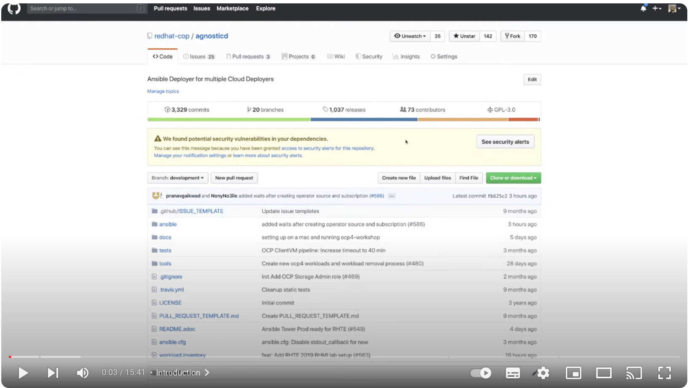

== Overview

This repo (repository) is the template repo that is used for creating new demos, workshops, labs, etc., typically to be deployed by RHDP (Red Hat Demo Platform). 

[cols="3*"]
|===

|*This repo*
|*Showroom Deployer*
|*End User Interface*

|image:.images/showroom-repo.png[alt text]
|
|

a|Your copy of this repo

* Content in Asciidoc
* Render logic by Antora

a|Our deployer

* Renders your content
* Orchestrates UI Services

a|End User Interface

* Displays your content
* Supplements with UI Services

|===

=== Basic Building Blocks

The basic building blocks of this repo are:

* Asciidoc 
** link:https://asciidoctor.org/[Main Asciidoc landing page]
** link:https://asciidoctor.org/docs/asciidoc-syntax-quick-reference/[Quick Reference]
* Antora scaffolding and tooling.
** link:https://docs.antora.org/antora/latest/[Antora Documentation]

== Quick Start

image:.images/showroom-repo.png[link:https://www.youtube.com/watch?v=lfHYwXJhKB0]

image:.images/showroom-repo.png image:.images/youtube.png[link:https://youtu.be/rAteGra5-xM]

This short video contains a high-level overview of using this repo as a template to create your content repo.

image:.images/showroom-repo.png[link:https://www.youtube.com/watch?v=lfHYwXJhKB0[Quick Start Video]]

video::lfHYwXJhKB0[youtube,width=640,height=360]

image:https://youtu.be/lfHYwXJhKB0?si=qqQiXNgSOmUJousw

=== What is Asciidoc and Antora?

To successfully create a simple demo for example some basic knowledge of Asciidoc and Antora is required.

A good, short, starting point is this video which gives a quick high-level view of creating how to use this repositary to creeate your own base repositary where you will create your content.

Typically onboarding your new content is as simple as providing the URL to your new repo and the rest is taken care of by the platform. 

=== What is Asciidoc and Antora?

This repo

=== Typical Steps

. Create a new repo using this repo as a *template* (not a fork)
. Clone the new repo to your local machine
. Edit your content in the file:documentation/modules/ROOT/pages/[directory]

=== Useful resources for getting started with Asciidic and Antora

=== Notes for Power Users

If you are a power user and want to do more than just create a new repo, you can use the following steps to create a new repo and then use it to create your own content.

new content and the process.

A good, short, starting point is this video which gives a quick high-level view of creating new content and the process.

Check the build courseware https://redhat-scholars.github.io/build-course[documentation]  on how folder structure, how to use macros and other gotchas