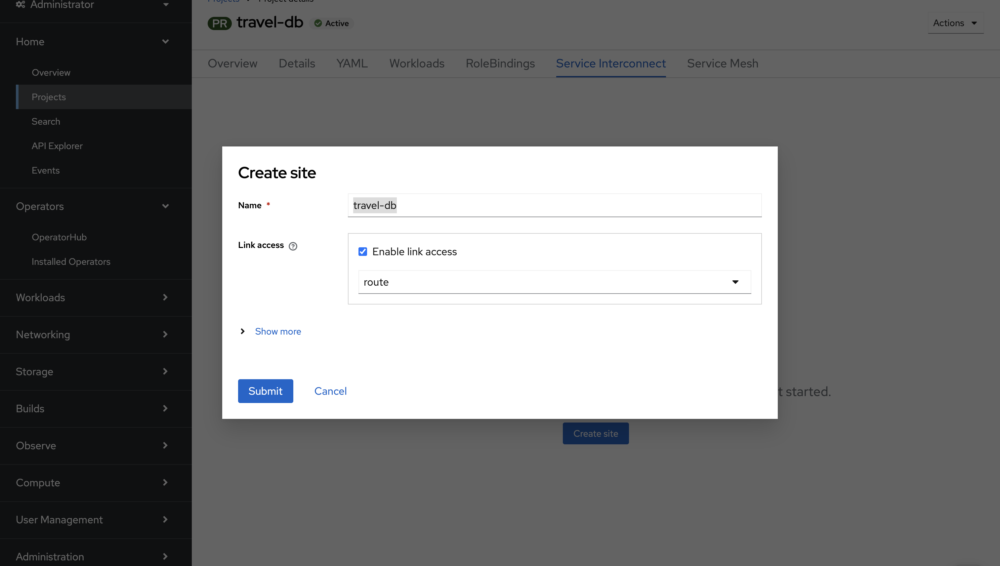

:imagesdir: ../../assets/images/m1
include::../style.adoc[]

== Presetup

== Activity: Setting up the site on OpenShift
You can setup Virtual Application Networks with Red Hat Service Interconnect by either using the command line interface or the Openshift operator. In this exercise we'll use the operator on the OpenShift cluster and the command line interface on the RHEL side to explore both options. 

* In a browser window, navigate to the browser tab pointing to the OpenShift cluster. If you don't have a browser tab open on the console, click on {openshift_cluster_console}[OpenShift Console, window="console"] to launch the console. If needed login with your username and password ({user_name}/{user_password}).

* Navigate to the Projects section under home and search and select *travel-db* project from the Admin Console as shown in the image below.
+
image::../assets/images/m1/search-travel-db-project.png[]

* Click on the Service Interconnect tab.
+
image::../assets/images/m1/rhsi_plugin_tab.png[]

* Create on *Create site*. This sets up the routers in the namespace. 

[.concept]
.What is a site?
****
A site represents a particular location and a particular platform. It's a place where you have real running workloads. Each site contains an application service router to communicate with local workloads and forward to peers in remote sites.
****

[.concept]
.What is a router?
****
Layer 7 application routers form the backbone of a VAN in the same way that conventional network routers form the backbone of a VPN. However, instead of routing IP packets between network endpoints, Layer 7 application routers route messages between application endpoints (called Layer 7 application addresses).
****

* Leave the default values and click on Submit. The *Enable link access* is checked indicating that this site will allow ingress connections from other sites.
+

* Once the site is created, you should see screen as shown in the image below.
+
image::../assets/images/m1/site_created.png[]

* Once the site creation is complete. Click on the *Deploy Network Console* button to visualize to network later
+
image::../assets/images/m1/deploy_console_rhsi.png[]

* Before we proceed,let us learn what a listener is.

[.concept]
.What is a Listener?
****
A listener binds a local connection endpoint to connectors in remote sites. Listeners and connectors are matched using routing keys.Each listener has an associated connection endpoint and routing key. The connection endpoint exposes a host and port for accepting connections from local clients. The routing key is a string identifier that binds the listener to connectors in remote sites. On Kubernetes, a listener is implemented as a Service. On Docker, Podman, and Linux, it is a listening socket bound to a local network interface.
****

* Click on *Create listener*. This sets up the listeners in the namespace.
+
image::../assets/images/m1/listener_button.png[]

* Input the following details and Submit.:
** Name: mysqldb
** Port: 3306
** Routing key: appconn
** Host: mysqldb
+
image::../assets/images/m1/listener_form.png[]

* Next, let's learn what a acsess token and create one.

[.concept]
.What is a token?
****
An access token is a short-lived credential used to create the link. An access token contains the URL and secret code of a corresponding access grant. Access tokens are issued from access grants. A grant issues zero or more tokens. Tokens are redeemed for links.
Access tokens have limited redemptions and limited lifespans. By default, they can be redeemed only once, and they expire 15 minutes after being issued. You can set custom limits by configuring the access grant.
****

image::../assets/images/m1/token_redemption_box.png[]

* Click on Generate a token
+
image::../assets/images/m1/token_button.png[]

* Input the following details and Click *Create*:
** FileName: my-grant
** Redemptions: 1
** Valid for: 60 minutes

* Click on *Done*. If you would like to inspect how the grant, feel feel to download and open the file. Ignore the token creation steps and as we'll use a script to convert and transfer it to our RHEL machine on-premises.
+
image::../assets/images/m1/grant_done_screen.png[]

== Activity: Setting up the site on RHEL
Similar to our OpenShift site, we will setup the site and routers on RHEL. We will using the Red Hat Service Interconnect command line interface to setup the site.
* In the terminal window, run the following command to log into the RHEL machine.
+
[source]
----
ssh -o ServerAliveInterval=60 -o ServerAliveCountMax=60 lab-user@hostname
----

* Enter your password {user_password} when prompted and press enter.

* You should now be logged into the RHEL machine. Let's see how we can setup a link between the database and the OpenShift cluster.

* In the terminal window, run the following command to create a site. Similar to our OpenShift site, this will setup the routers in the namespace.
+
[source]
----
export SKUPPER_PLATFORM=podman
skupper site create rhel
----

* You should see the following output.
+
source
----
File written to /home/lab-user/.local/share/skupper/namespaces/default/input/resources/sites/rhel.yaml
----

* Next let's learn what a connector is.

[.concept]
.What is a connector?
****
A connector binds a local workload to listeners in remote sites. Listeners and connectors are matched using routing keys. Each connector has an associated workload and routing key. The workload can be specified as a Kubernetes pod selector or as the host and port of a local network service. The routing key is a string identifier that binds the connector to listeners in remote sites.

On Kubernetes, the workload is usually specified using a pod selector. On Docker, Podman, and Linux, it is specified using a host and port.
****
+
image::../assets/images/m1/connector_arch.png[]

* In the same terminal window, run the following command to create a connector.
+
[source]
----
skupper connector create mysqldb 3306 --host 127.0.0.1 -r appconn
----

* You should see the following output.

== Activity: Transferring secure token to RHEL
* In the OpenShift terminal, run the following script to transfer the token. Enter the RHEL password {user_password} when prompted.
+
[source]
----
chmod +x convert.sh 

./convert.sh > summit_token.yaml && scp summit_token.yaml lab-user@hostname.opentlc.com:/home/lab-user/.local/share/skupper/namespaces/default/input/resources/
----

* Since the token has now been transferred to the RHEL machine, let's start the Virtual Application Network by running the below command from the RHEL terminal. 
+
[source]
----
skupper system setup
----

* You should see the following output.
+
source
----
Sources will be consumed from namespace "default"
It is recommended to enable lingering for lab-user, otherwise Skupper may not start on boot.
Site "rhel" has been created on namespace "default"
Platform: podman
Definition is available at: /home/lab-user/.local/share/skupper/namespaces/default/input/resources
----

== Activity: 
. Console

=== Summary:

You learnt how to use {rhsi} to securely bridge on-prem and cloud workloads with minimal complexity.

